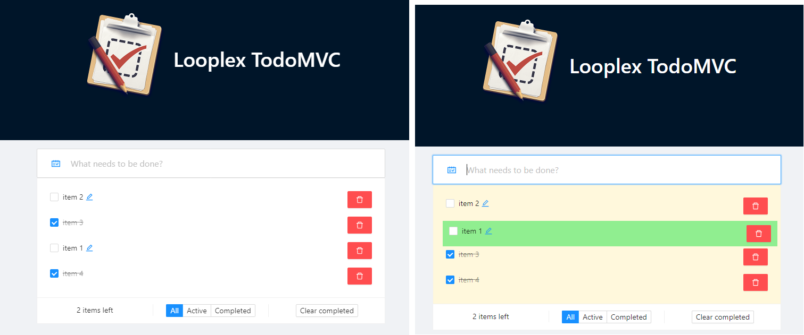

# TodoMVC
> A TodoMVC é uma To Do List baseada na [TodoMVC funcionality](https://github.com/tastejs/todomvc/blob/master/app-spec.md#functionality).
> O projeto foi desenvolvido em [ReactJS](https://reactjs.org), com o gerenciamento de estados feito por meio da biblioteca [Mobx-state-tree](https://mobx-state-tree.js.org/intro/welcome). 
> O layout e os coponentes de UI foram desenvolvidos com a biblioteca [Ant Design](https://ant.design).
> Para implementação da funcionalidade drag-and-drop da lista de tarefas, foi utilizada a biblioteca [react-beautiful-dnd](https://github.com/atlassian/react-beautiful-dnd). 

## Como utilizar

A aplicação está disponível (neste link)[https://todo-mvc-pi.vercel.app].

## 🛠 Tecnologias utilizadas:

- [ReactJS](https://reactjs.org)
- [Mobx-state-tree](https://mobx-state-tree.js.org/intro/welcome)
- [react-beautiful-dnd](https://github.com/atlassian/react-beautiful-dnd)
- [CSS](https://www.w3.org/TR/CSS/#css)

## 🧔 Autor
 

Feito por Gustavo Oliveira Dias 👋🏽

 

